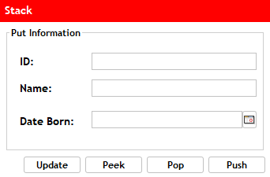

# Vector Stack
There are two forms to make the Stack Data Structure. The first would be with a Vector
where the first class that u would be make in the model package:

```java
package Model;
public class VectorStack <T>{
  private Object[] array;
  private int size;
  private static int arraySize = 10;
}
```
And the constructor u can placed:
```java
  public VectorStack(){
  array = new Object[arraySize];
  size = 0;
```
And respective gets and the others methods:
```java
  public int getSize(){
  return size;
  }

  public T getIndex(int index){
  if(index >= 0 && index < size){
  return (T) array[indThe ex];
  }else{
  throw new IndexOutOfBoundsException("Index out of bounds");
```
Verify the size is equals that 0, First created this boolean method and the other second method is about check the size of array to expand:
```java
public boolean isEmpty(){
return size == 0;
}

public void checkSize(){
  if(size == array.length)
  array = java.util.Arrays.copyOf(array, size * 2);
}
```
now lets to created the serious methods that are:
### Push
```java
```
### Pop
```java
```
### Pop

<div align="center">
  


</div>
